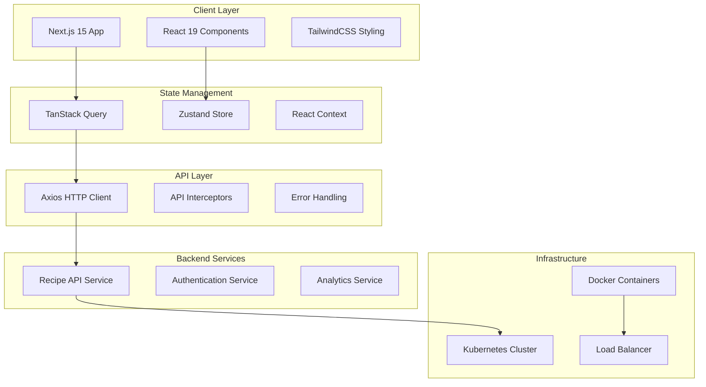
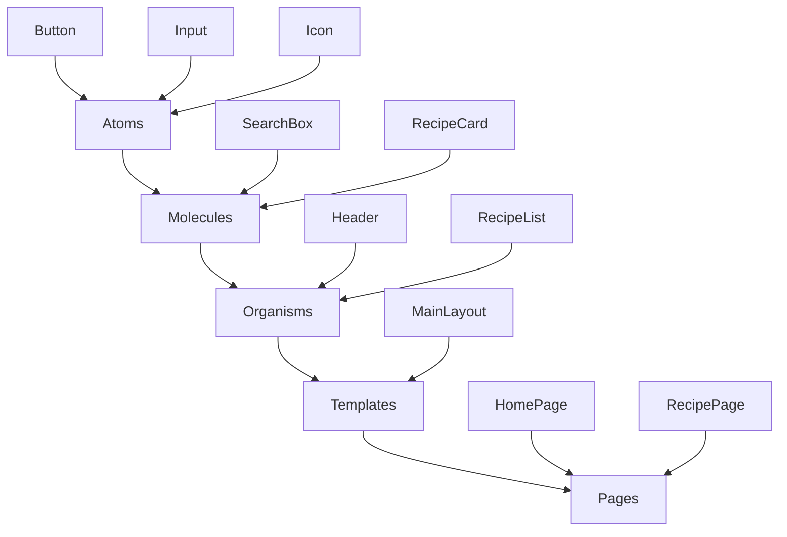
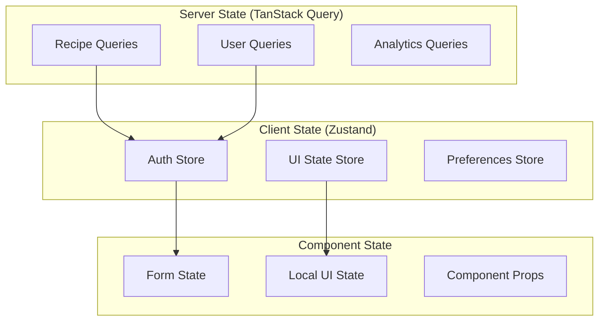
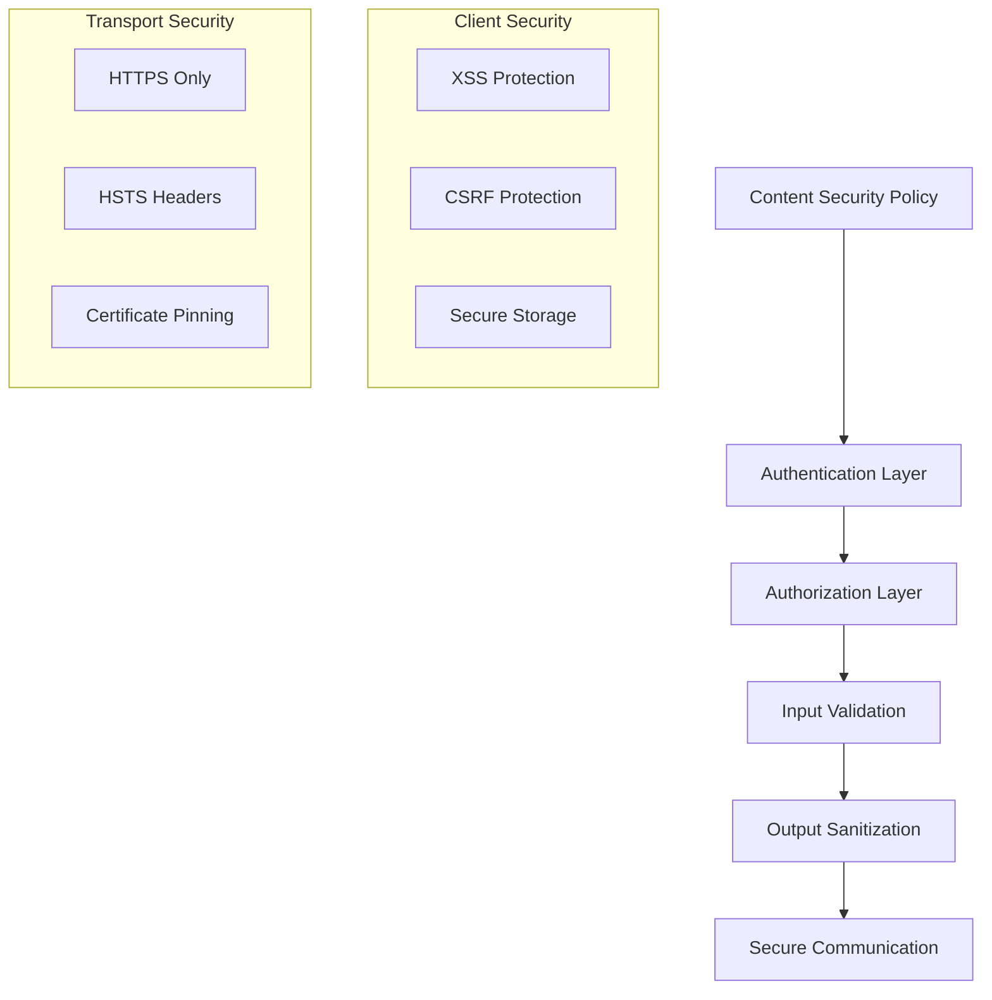
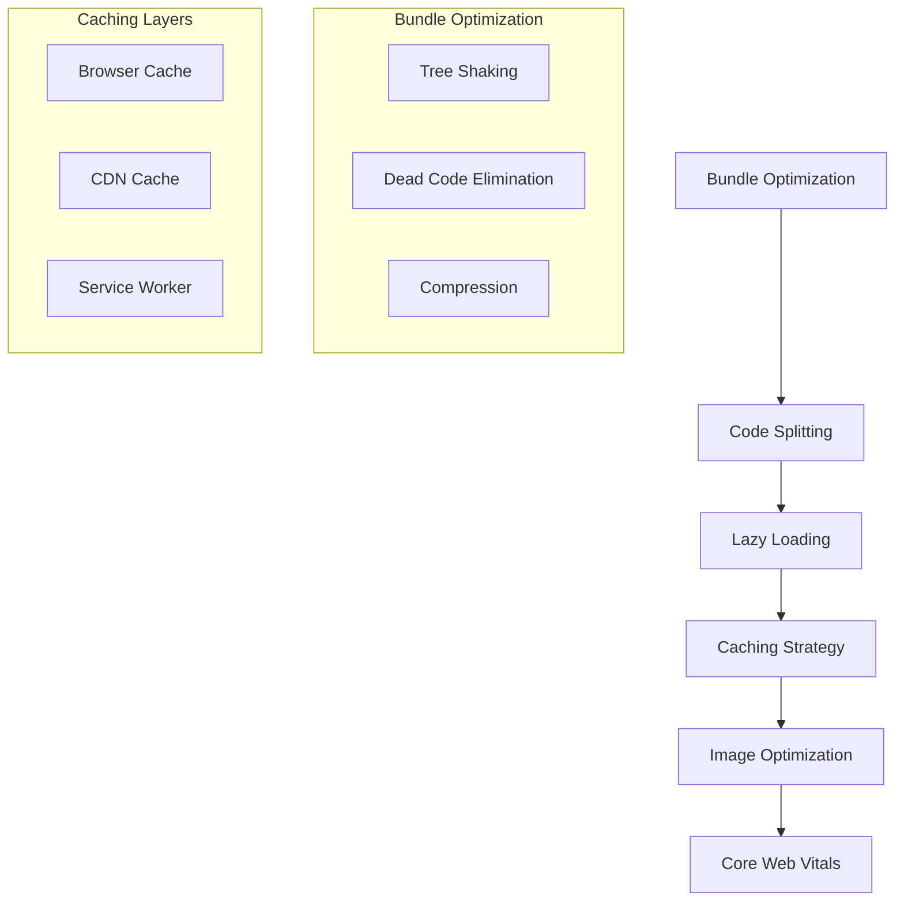

# 🏗️ System Architecture Guide

This document provides a comprehensive overview of the Recipe UI Service architecture, including system design
patterns, component interactions, and technical decisions.

## 📋 Table of Contents

- [System Overview](#-system-overview)
- [Architecture Patterns](#-architecture-patterns)
- [Component Architecture](#component-architecture)
- [State Management](#-state-management)
- [API Integration](#-api-integration)
- [Security Architecture](#-security-architecture)
- [Performance Architecture](#-performance-architecture)
- [Testing Architecture](#-testing-architecture)
- [Deployment Architecture](#-deployment-architecture)
- [Scalability Considerations](#-scalability-considerations)

## 🌐 System Overview

### High-Level Architecture



### Technology Stack Overview

| Layer                 | Technology               | Purpose                                       |
| --------------------- | ------------------------ | --------------------------------------------- |
| **Frontend**          | Next.js 15 + React 19    | Server-side rendering and component framework |
| **Styling**           | TailwindCSS + PostCSS    | Utility-first styling with design system      |
| **State Management**  | TanStack Query + Zustand | Server and client state management            |
| **API Communication** | Axios                    | HTTP client with interceptors                 |
| **Testing**           | Jest + Playwright + RTL  | Comprehensive testing strategy                |
| **Build System**      | Turbopack                | Fast development and production builds        |
| **Infrastructure**    | Docker + Kubernetes      | Containerized deployment                      |

## 🔧 Architecture Patterns

### 1. **Feature-Based Architecture**

The application follows a feature-based architecture where each feature is self-contained with its own
components, hooks, types, and tests.

```text
src/
├── app/                    # Next.js App Router (Routes)
├── components/             # Reusable UI Components
│   ├── ui/                # Base design system components
│   ├── forms/             # Form-specific components
│   └── layout/            # Layout and navigation components
├── hooks/                 # Custom React hooks (feature-specific)
├── lib/                   # Shared utilities and configurations
│   ├── api/              # API client and endpoints
│   ├── auth/             # Authentication utilities
│   └── utils/            # General purpose utilities
├── stores/               # Zustand state stores
├── types/                # TypeScript type definitions
└── constants/            # Application constants
```

### 2. **Separation of Concerns**

#### **Presentation Layer** (`src/components/`)

- Pure presentation components with minimal business logic
- Receives data via props and communicates through callbacks
- Focuses on UI/UX and accessibility

#### **Business Logic Layer** (`src/hooks/`)

- Custom hooks encapsulate business logic and side effects
- Integration with external APIs and state management
- Reusable across multiple components

#### **Data Layer** (`src/lib/api/` + `src/stores/`)

- API client configuration and endpoint definitions
- Client-side state management with Zustand
- Server state management with TanStack Query

#### **Configuration Layer** (`src/lib/` + `src/constants/`)

- Application configuration and constants
- Utility functions and helpers
- Environment-specific settings

### 3. **Atomic Design System**

Components follow atomic design principles:



## Component Architecture

### Component Hierarchy

```typescript
// Base Component Interface
interface BaseComponentProps {
  className?: string;
  children?: React.ReactNode;
  'data-testid'?: string;
}

// Component Types
type ComponentVariant = 'primary' | 'secondary' | 'outline' | 'ghost';
type ComponentSize = 'sm' | 'md' | 'lg' | 'xl';

// Example: Button Component Architecture
interface ButtonProps extends BaseComponentProps {
  variant?: ComponentVariant;
  size?: ComponentSize;
  disabled?: boolean;
  loading?: boolean;
  onClick?: (event: MouseEvent<HTMLButtonElement>) => void;
}
```

### Component Patterns

#### 1. **Container/Presenter Pattern**

```typescript
// Container Component (Business Logic)
export function RecipeListContainer() {
  const { data: recipes, isLoading, error } = useRecipes();
  const { user } = useAuth();

  const handleRecipeClick = useCallback((recipeId: string) => {
    // Business logic
  }, []);

  return (
    <RecipeListPresenter
      recipes={recipes}
      loading={isLoading}
      error={error}
      onRecipeClick={handleRecipeClick}
      canEdit={user?.role === 'admin'}
    />
  );
}

// Presenter Component (Pure UI)
interface RecipeListPresenterProps {
  recipes?: Recipe[];
  loading: boolean;
  error?: Error;
  onRecipeClick: (id: string) => void;
  canEdit: boolean;
}

export function RecipeListPresenter({ recipes, loading, onRecipeClick }: RecipeListPresenterProps) {
  if (loading) return <RecipeListSkeleton />;
  if (error) return <ErrorBoundary error={error} />;

  return (
    <div className="grid grid-cols-1 md:grid-cols-2 lg:grid-cols-3 gap-6">
      {recipes?.map(recipe => (
        <RecipeCard
          key={recipe.id}
          recipe={recipe}
          onClick={() => onRecipeClick(recipe.id)}
        />
      ))}
    </div>
  );
}
```

#### 2. **Compound Components Pattern**

```typescript
// Compound Component for Complex UI
export function RecipeForm({ children, onSubmit }: RecipeFormProps) {
  return (
    <form onSubmit={onSubmit} className="space-y-6">
      {children}
    </form>
  );
}

RecipeForm.Title = function RecipeFormTitle({ children }: { children: React.ReactNode }) {
  return <input className="text-2xl font-bold" placeholder="Recipe title..." />;
};

RecipeForm.Ingredients = function RecipeFormIngredients() {
  return <IngredientsEditor />;
};

RecipeForm.Instructions = function RecipeFormInstructions() {
  return <InstructionsEditor />;
};

// Usage
<RecipeForm onSubmit={handleSubmit}>
  <RecipeForm.Title />
  <RecipeForm.Ingredients />
  <RecipeForm.Instructions />
</RecipeForm>
```

### Component Organization

```text
components/
├── ui/                     # Base components (Atoms)
│   ├── Button/
│   │   ├── Button.tsx
│   │   ├── Button.test.tsx
│   │   ├── Button.stories.tsx
│   │   └── index.ts
│   └── Input/
├── forms/                  # Form components (Molecules)
│   ├── RecipeForm/
│   └── SearchForm/
└── layout/                 # Layout components (Organisms)
    ├── Header/
    ├── Sidebar/
    └── Footer/
```

## 🔄 State Management

### State Architecture Overview



### 1. **Client State Management (Zustand)**

```typescript
// Auth Store
interface AuthState {
  user: User | null;
  token: string | null;
  isAuthenticated: boolean;
  login: (credentials: LoginCredentials) => Promise<void>;
  logout: () => void;
  refreshToken: () => Promise<void>;
}

export const useAuthStore = create<AuthState>((set, get) => ({
  user: null,
  token: null,
  isAuthenticated: false,

  login: async credentials => {
    const { user, token } = await authApi.login(credentials);
    set({ user, token, isAuthenticated: true });
    localStorage.setItem('auth-token', token);
  },

  logout: () => {
    set({ user: null, token: null, isAuthenticated: false });
    localStorage.removeItem('auth-token');
  },

  refreshToken: async () => {
    const { token } = await authApi.refreshToken();
    set({ token });
    localStorage.setItem('auth-token', token);
  },
}));

// UI State Store
interface UIState {
  theme: 'light' | 'dark';
  sidebar: {
    isOpen: boolean;
    toggleSidebar: () => void;
  };
  notifications: Notification[];
  addNotification: (notification: Notification) => void;
  removeNotification: (id: string) => void;
}
```

### 2. **Server State Management (TanStack Query)**

```typescript
// Recipe Queries
export const recipeQueries = {
  all: ['recipes'] as const,
  lists: () => [...recipeQueries.all, 'list'] as const,
  list: (filters: RecipeFilters) =>
    [...recipeQueries.lists(), { filters }] as const,
  details: () => [...recipeQueries.all, 'detail'] as const,
  detail: (id: string) => [...recipeQueries.details(), id] as const,
};

// Recipe Query Hooks
export function useRecipes(filters: RecipeFilters = {}) {
  return useQuery({
    queryKey: recipeQueries.list(filters),
    queryFn: () => recipesApi.getRecipes(filters),
    staleTime: 5 * 60 * 1000, // 5 minutes
    cacheTime: 10 * 60 * 1000, // 10 minutes
  });
}

export function useRecipe(id: string) {
  return useQuery({
    queryKey: recipeQueries.detail(id),
    queryFn: () => recipesApi.getRecipe(id),
    enabled: !!id,
  });
}

// Recipe Mutation Hooks
export function useCreateRecipe() {
  const queryClient = useQueryClient();

  return useMutation({
    mutationFn: recipesApi.createRecipe,
    onSuccess: newRecipe => {
      // Optimistic update
      queryClient.setQueryData(recipeQueries.detail(newRecipe.id), newRecipe);

      // Invalidate list queries
      queryClient.invalidateQueries({
        queryKey: recipeQueries.lists(),
      });
    },
  });
}
```

### 3. **State Synchronization Patterns**

#### **Authentication State Sync**

```typescript
// Sync auth state with API client
export function useAuthSync() {
  const { token, refreshToken } = useAuthStore();

  useEffect(() => {
    if (token) {
      apiClient.defaults.headers.Authorization = `Bearer ${token}`;
    }
  }, [token]);

  // Auto-refresh token
  useEffect(() => {
    const interval = setInterval(() => {
      if (token && isTokenExpiringSoon(token)) {
        refreshToken();
      }
    }, 60000); // Check every minute

    return () => clearInterval(interval);
  }, [token, refreshToken]);
}
```

## 🔗 API Integration

### API Client Architecture

```typescript
// Base API Client Configuration
export const apiClient = axios.create({
  baseURL: process.env.NEXT_PUBLIC_API_URL,
  timeout: 10000,
  headers: {
    'Content-Type': 'application/json',
  },
});

// Request Interceptor
apiClient.interceptors.request.use(
  config => {
    const token = useAuthStore.getState().token;
    if (token) {
      config.headers.Authorization = `Bearer ${token}`;
    }
    return config;
  },
  error => Promise.reject(error)
);

// Response Interceptor
apiClient.interceptors.response.use(
  response => response,
  async error => {
    const originalRequest = error.config;

    if (error.response?.status === 401 && !originalRequest._retry) {
      originalRequest._retry = true;

      try {
        await useAuthStore.getState().refreshToken();
        const token = useAuthStore.getState().token;
        originalRequest.headers.Authorization = `Bearer ${token}`;
        return apiClient(originalRequest);
      } catch (refreshError) {
        useAuthStore.getState().logout();
        window.location.href = '/login';
        return Promise.reject(refreshError);
      }
    }

    return Promise.reject(error);
  }
);
```

### API Service Pattern

```typescript
// Recipe API Service
export class RecipeApiService {
  async getRecipes(filters: RecipeFilters): Promise<RecipesResponse> {
    const { data } = await apiClient.get('/recipes', { params: filters });
    return data;
  }

  async getRecipe(id: string): Promise<Recipe> {
    const { data } = await apiClient.get(`/recipes/${id}`);
    return data;
  }

  async createRecipe(recipe: CreateRecipeRequest): Promise<Recipe> {
    const { data } = await apiClient.post('/recipes', recipe);
    return data;
  }

  async updateRecipe(id: string, recipe: UpdateRecipeRequest): Promise<Recipe> {
    const { data } = await apiClient.put(`/recipes/${id}`, recipe);
    return data;
  }

  async deleteRecipe(id: string): Promise<void> {
    await apiClient.delete(`/recipes/${id}`);
  }

  // Bulk operations
  async bulkUpdateRecipes(updates: BulkRecipeUpdate[]): Promise<Recipe[]> {
    const { data } = await apiClient.post('/recipes/bulk-update', { updates });
    return data;
  }
}

export const recipesApi = new RecipeApiService();
```

### Error Handling Architecture

```typescript
// API Error Types
export class ApiError extends Error {
  constructor(
    message: string,
    public status: number,
    public code?: string,
    public details?: unknown
  ) {
    super(message);
    this.name = 'ApiError';
  }
}

// Error Boundary Component
export class ApiErrorBoundary extends Component<
  PropsWithChildren<{ fallback?: ComponentType<{ error: Error }> }>,
  { hasError: boolean; error?: Error }
> {
  constructor(props: PropsWithChildren<{ fallback?: ComponentType<{ error: Error }> }>) {
    super(props);
    this.state = { hasError: false };
  }

  static getDerivedStateFromError(error: Error): { hasError: boolean; error: Error } {
    return { hasError: true, error };
  }

  componentDidCatch(error: Error, errorInfo: ErrorInfo) {
    console.error('API Error caught by boundary:', error, errorInfo);

    // Send to error reporting service
    errorReporting.captureException(error, {
      extra: errorInfo,
      tags: { component: 'ApiErrorBoundary' }
    });
  }

  render() {
    if (this.state.hasError) {
      const FallbackComponent = this.props.fallback || DefaultErrorFallback;
      return <FallbackComponent error={this.state.error!} />;
    }

    return this.props.children;
  }
}
```

## 🔒 Security Architecture

### Security Layers



### 1. **Authentication & Authorization**

```typescript
// JWT Token Management
export class TokenManager {
  private static readonly TOKEN_KEY = 'auth-token';
  private static readonly REFRESH_KEY = 'refresh-token';

  static setTokens(accessToken: string, refreshToken: string): void {
    // Use secure storage in production
    const storage = this.isProduction() ? this.getSecureStorage() : localStorage;
    storage.setItem(this.TOKEN_KEY, accessToken);
    storage.setItem(this.REFRESH_KEY, refreshToken);
  }

  static getAccessToken(): string | null {
    const storage = this.isProduction() ? this.getSecureStorage() : localStorage;
    return storage.getItem(this.TOKEN_KEY);
  }

  static clearTokens(): void {
    const storage = this.isProduction() ? this.getSecureStorage() : localStorage;
    storage.removeItem(this.TOKEN_KEY);
    storage.removeItem(this.REFRESH_KEY);
  }

  private static isProduction(): boolean {
    return process.env.NODE_ENV === 'production';
  }
}

// Role-Based Access Control
export function withAuth<P extends object>(
  Component: ComponentType<P>,
  requiredRoles?: UserRole[]
) {
  return function AuthenticatedComponent(props: P) {
    const { user, isAuthenticated } = useAuth();

    if (!isAuthenticated) {
      return <LoginPrompt />;
    }

    if (requiredRoles && !hasRequiredRole(user, requiredRoles)) {
      return <UnauthorizedError requiredRoles={requiredRoles} />;
    }

    return <Component {...props} />;
  };
}
```

### 2. **Input Validation & Sanitization**

```typescript
// Input Validation Schema
export const recipeValidationSchema = z.object({
  title: z
    .string()
    .min(3, 'Title must be at least 3 characters')
    .max(100, 'Title must be less than 100 characters')
    .regex(/^[a-zA-Z0-9\s-]+$/, 'Title contains invalid characters'),

  description: z
    .string()
    .max(500, 'Description must be less than 500 characters')
    .optional(),

  ingredients: z
    .array(z.string().min(1))
    .min(1, 'At least one ingredient is required'),

  instructions: z
    .array(z.string().min(1))
    .min(1, 'At least one instruction is required'),

  cookingTime: z
    .number()
    .min(1, 'Cooking time must be at least 1 minute')
    .max(1440, 'Cooking time cannot exceed 24 hours'),

  servings: z
    .number()
    .min(1, 'Must serve at least 1 person')
    .max(50, 'Cannot serve more than 50 people'),
});

// Sanitization Utilities
export class InputSanitizer {
  static sanitizeHtml(input: string): string {
    return DOMPurify.sanitize(input, {
      ALLOWED_TAGS: ['b', 'i', 'em', 'strong'],
      ALLOWED_ATTR: [],
    });
  }

  static sanitizeForSearch(input: string): string {
    return input
      .replace(/[^\w\s-]/g, '') // Remove special characters
      .trim()
      .toLowerCase();
  }

  static validateAndSanitize<T>(data: unknown, schema: z.ZodSchema<T>): T {
    const result = schema.safeParse(data);
    if (!result.success) {
      throw new ValidationError('Input validation failed', result.error);
    }
    return result.data;
  }
}
```

### 3. **Content Security Policy**

```typescript
// Next.js Security Headers
export const securityHeaders = [
  {
    key: 'Content-Security-Policy',
    value: [
      "default-src 'self'",
      "script-src 'self' 'unsafe-eval' 'unsafe-inline' https://cdn.jsdelivr.net",
      "style-src 'self' 'unsafe-inline' https://fonts.googleapis.com",
      "font-src 'self' https://fonts.gstatic.com",
      "img-src 'self' data: https:",
      "connect-src 'self' https://api.recipe-app.com",
      "frame-ancestors 'none'",
      "base-uri 'self'",
      "form-action 'self'",
    ].join('; '),
  },
  {
    key: 'X-Frame-Options',
    value: 'DENY',
  },
  {
    key: 'X-Content-Type-Options',
    value: 'nosniff',
  },
  {
    key: 'Referrer-Policy',
    value: 'strict-origin-when-cross-origin',
  },
  {
    key: 'Strict-Transport-Security',
    value: 'max-age=31536000; includeSubDomains',
  },
];
```

## ⚡ Performance Architecture

### Performance Optimization Strategy



### 1. **Code Splitting & Lazy Loading**

```typescript
// Route-based Code Splitting
const HomePage = lazy(() => import('../pages/HomePage'));
const RecipePage = lazy(() => import('../pages/RecipePage'));
const ProfilePage = lazy(() => import('../pages/ProfilePage'));

// Component-based Code Splitting
const RecipeEditor = lazy(() =>
  import('../components/RecipeEditor').then(module => ({
    default: module.RecipeEditor
  }))
);

// Dynamic Import with Loading States
export function LazyRecipeEditor({ recipeId }: { recipeId: string }) {
  return (
    <Suspense fallback={<RecipeEditorSkeleton />}>
      <RecipeEditor recipeId={recipeId} />
    </Suspense>
  );
}
```

### 2. **Caching Strategy**

```typescript
// TanStack Query Caching Configuration
export const queryClient = new QueryClient({
  defaultOptions: {
    queries: {
      staleTime: 5 * 60 * 1000, // 5 minutes
      cacheTime: 10 * 60 * 1000, // 10 minutes
      retry: 3,
      retryDelay: attemptIndex => Math.min(1000 * 2 ** attemptIndex, 30000),
      refetchOnWindowFocus: false,
      refetchOnReconnect: 'always',
    },
    mutations: {
      retry: 1,
    },
  },
});

// Service Worker Caching
export const cacheConfig = {
  runtimeCaching: [
    {
      urlPattern: /^https:\/\/api\.recipe-app\.com\//,
      handler: 'NetworkFirst',
      options: {
        cacheName: 'api-cache',
        expiration: {
          maxEntries: 100,
          maxAgeSeconds: 60 * 60, // 1 hour
        },
      },
    },
    {
      urlPattern: /\.(?:png|jpg|jpeg|svg|webp)$/,
      handler: 'CacheFirst',
      options: {
        cacheName: 'image-cache',
        expiration: {
          maxEntries: 200,
          maxAgeSeconds: 30 * 24 * 60 * 60, // 30 days
        },
      },
    },
  ],
};
```

### 3. **Performance Monitoring**

```typescript
// Core Web Vitals Tracking
export function usePerformanceMonitoring() {
  useEffect(() => {
    // Track Core Web Vitals
    getCLS(metric => {
      analytics.track('Core Web Vital', {
        metric: 'CLS',
        value: metric.value,
        rating: metric.rating,
      });
    });

    getFID(metric => {
      analytics.track('Core Web Vital', {
        metric: 'FID',
        value: metric.value,
        rating: metric.rating,
      });
    });

    getLCP(metric => {
      analytics.track('Core Web Vital', {
        metric: 'LCP',
        value: metric.value,
        rating: metric.rating,
      });
    });
  }, []);
}

// Performance Budget Monitoring
export const performanceBudgets = {
  'main-bundle': { maxSize: '250KB' },
  'vendor-bundle': { maxSize: '150KB' },
  'css-bundle': { maxSize: '50KB' },
  'image-assets': { maxSize: '500KB' },
};
```

## 🧪 Testing Architecture

### Testing Pyramid

```mermaid
pyramid TB
    A[E2E Tests<br/>5%] --> B[Integration Tests<br/>25%]
    B --> C[Unit Tests<br/>70%]

    subgraph "Test Types"
        D[Unit Tests<br/>Components, Hooks, Utils]
        E[Integration Tests<br/>Frontend & Backend]
        F[E2E Tests<br/>Critical User Journeys]
        G[Visual Tests<br/>UI Regression]
        H[Performance Tests<br/>Core Web Vitals]
    end
```

### Testing Strategy Implementation

```typescript
// Test Utilities Setup
export function createTestWrapper() {
  const queryClient = new QueryClient({
    defaultOptions: {
      queries: { retry: false },
      mutations: { retry: false },
    },
  });

  return function TestWrapper({ children }: { children: React.ReactNode }) {
    return (
      <QueryClientProvider client={queryClient}>
        <BrowserRouter>
          {children}
        </BrowserRouter>
      </QueryClientProvider>
    );
  };
}

// Custom Render Function
export function renderWithProviders(
  component: ReactElement,
  options?: { initialState?: Partial<AppState> }
) {
  const Wrapper = createTestWrapper();

  return {
    ...render(component, { wrapper: Wrapper }),
    store: mockStore,
  };
}
```

For more detailed testing information, see [TESTING.md](TESTING.md).

## 🚀 Deployment Architecture

### Container Architecture

```dockerfile
# Multi-stage Docker Build
FROM node:20-alpine AS base
WORKDIR /app
COPY package*.json ./
RUN npm ci --only=production && npm cache clean --force

FROM base AS build
RUN npm ci
COPY . .
RUN npm run build

FROM base AS runtime
COPY --from=build /app/.next ./.next
COPY --from=build /app/public ./public
EXPOSE 3000
CMD ["npm", "start"]
```

### Kubernetes Deployment

```yaml
# Deployment Configuration
apiVersion: apps/v1
kind: Deployment
metadata:
  name: recipe-ui-service
spec:
  replicas: 3
  strategy:
    type: RollingUpdate
    rollingUpdate:
      maxSurge: 1
      maxUnavailable: 0
  template:
    spec:
      containers:
        - name: recipe-ui
          image: recipe-ui-service:latest
          ports:
            - containerPort: 3000
          resources:
            limits:
              memory: '512Mi'
              cpu: '500m'
            requests:
              memory: '256Mi'
              cpu: '250m'
          livenessProbe:
            httpGet:
              path: /api/health
              port: 3000
            initialDelaySeconds: 30
            periodSeconds: 10
          readinessProbe:
            httpGet:
              path: /api/ready
              port: 3000
            initialDelaySeconds: 5
            periodSeconds: 5
```

For detailed deployment information, see [DEPLOYMENT.md](DEPLOYMENT.md).

## 📈 Scalability Considerations

### Horizontal Scaling Strategy

1. **Stateless Design**: All components are designed to be stateless
2. **Load Balancing**: Multiple instances behind load balancer
3. **Database Scaling**: Read replicas and connection pooling
4. **CDN Integration**: Static assets served from CDN
5. **Caching Layers**: Multiple levels of caching

### Performance Optimization

1. **Bundle Splitting**: Route-based and component-based splitting
2. **Lazy Loading**: On-demand component loading
3. **Image Optimization**: Next.js image optimization with WebP/AVIF
4. **Service Worker**: Offline capability and asset caching
5. **Database Optimization**: Query optimization and indexing

### Monitoring & Observability

1. **Application Metrics**: Performance and business metrics
2. **Error Tracking**: Centralized error reporting
3. **Log Aggregation**: Structured logging with correlation IDs
4. **Health Checks**: Comprehensive health monitoring
5. **Alerting**: Proactive monitoring with intelligent alerts

---

This architecture provides a solid foundation for a scalable, maintainable, and secure Next.js application.
The patterns and practices outlined here ensure consistency across the codebase while allowing for future
growth and evolution.
