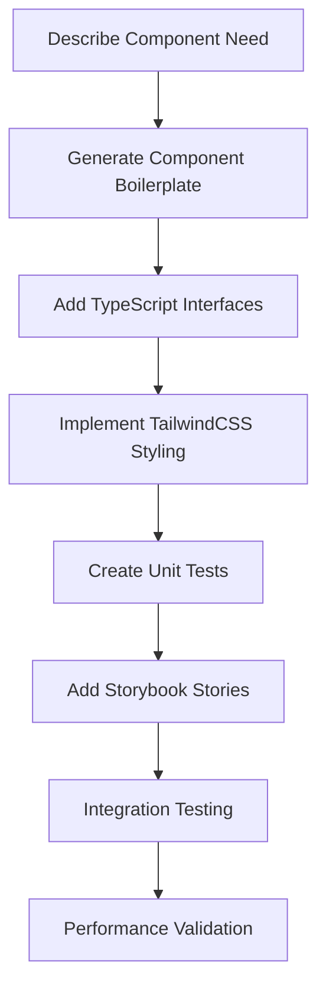
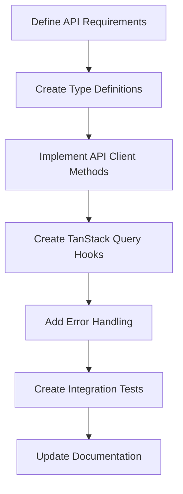
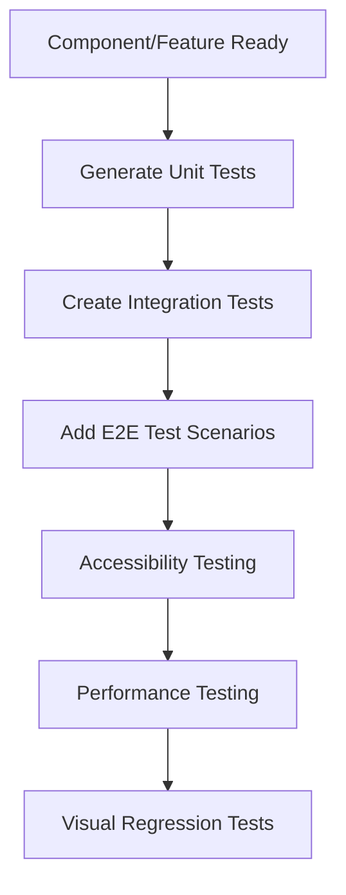

# 🤖 Claude Code Integration Guide

This document provides comprehensive guidance for using Claude Code with this Recipe UI Service project,
optimizing your AI-assisted development workflow.

## 🚀 Quick Start

### Setting Up Claude Code for This Project

1. **Project Recognition**: Claude Code automatically recognizes this as a Next.js project with enterprise-grade tooling
2. **Context Loading**: Key project files are automatically indexed for better assistance
3. **Tool Integration**: All project scripts and tools are available for Claude Code operations

### Key Project Commands for Claude Code

```bash
# Development workflow
npm run dev                    # Start development server
npm run build                 # Production build
npm run test                  # Run all tests
npm run lint                  # Code quality checks

# Claude Code friendly commands
npm run test:watch            # Interactive testing
npm run type-check           # TypeScript validation
npm run analyze              # Bundle analysis
```

## 🛠️ Claude Code Workflows

### 1. **Development Workflow Integration**

#### Starting a New Feature

```bash
# Claude Code can help you:
git checkout -b feature/new-feature
npm run dev                   # Start development server
npm run test:watch           # Start test watcher
```

**Claude Code Tips:**

- Mention the feature you're building for context-aware suggestions
- Ask Claude to generate component boilerplate following project patterns
- Request test cases that match the project's testing strategy

#### Code Quality Assurance

```bash
# Run these before committing (Claude Code can run these for you):
npm run lint                 # ESLint with 60+ rules
npm run type-check          # TypeScript validation
npm run test                # Unit and integration tests
npm run format              # Prettier formatting
```

### 2. **AI-Assisted Code Generation**

#### Component Creation

When asking Claude Code to create components, mention:

- **Project structure**: "Create a component following the src/components structure"
- **Styling approach**: "Use TailwindCSS with our design system"
- **Testing requirements**: "Include unit tests with React Testing Library"
- **TypeScript**: "Use strict TypeScript with proper interfaces"

**Example Request:**

```text
Create a RecipeCard component in src/components/ui/ that displays recipe
information, uses TailwindCSS styling, includes proper TypeScript interfaces,
and follows our project's component patterns. Also create unit tests.
```

#### API Integration

For API-related code:

- Reference `src/lib/api/client.ts` for HTTP client patterns
- Use TanStack Query patterns from `src/hooks/use-recipes.ts`
- Follow error handling patterns established in the project

**Example Request:**

```text
Create a new API hook for user management that follows the TanStack Query
patterns in src/hooks/use-recipes.ts, uses our API client from
src/lib/api/client.ts, and includes proper error handling.
```

### 3. **Testing Integration**

#### Test Generation

Claude Code can generate tests following project patterns:

```bash
# Test types available:
npm run test:unit            # Unit tests
npm run test:integration     # Integration tests
npm run test:e2e            # End-to-end tests
npm run test:coverage       # Coverage reports
```

**Testing Request Examples:**

```text
Generate unit tests for the RecipeCard component using React Testing Library,
following the patterns in tests/unit/components/. Include accessibility
testing and user interaction scenarios.

Create integration tests for the recipe creation workflow following the
frontend integration test patterns in tests/integration/frontend/.
```

### 4. **Performance Optimization**

#### Performance Analysis

Claude Code can help analyze and optimize performance:

```bash
# Performance commands Claude Code can run:
npm run analyze             # Bundle analysis
npm run size-limit         # Bundle size validation
npm run perf:vitals        # Core Web Vitals testing
npm run perf:lighthouse    # Lighthouse audits
```

**Performance Request Example:**

```text
Analyze the current bundle size using npm run analyze and suggest
optimizations for the largest chunks. Focus on code splitting and
tree shaking opportunities.
```

## 🔧 Project-Specific Claude Code Commands

### Custom Commands Available

Claude Code has access to all package.json scripts:

```json
{
  "dev": "Start development server with Turbopack",
  "build": "Production build",
  "test:unit": "Unit tests only",
  "test:integration:frontend": "Frontend integration tests",
  "test:integration:backend": "Backend integration tests",
  "test:e2e": "End-to-end tests with Playwright",
  "test:performance": "Performance testing suite",
  "test:visual": "Visual regression testing",
  "test:a11y": "Accessibility testing",
  "lint": "ESLint with auto-fix",
  "type-check": "TypeScript validation",
  "format": "Prettier code formatting",
  "analyze": "Bundle size analysis",
  "knip": "Unused code detection",
  "madge": "Circular dependency check"
}
```

### Advanced Workflows

#### Security Scanning

```bash
# Claude Code can run security checks:
npm audit                   # Dependency vulnerabilities
npm run lint               # Security-focused ESLint rules
secretlint                 # Secret detection
```

#### Quality Gates

```bash
# Pre-commit simulation:
npm run lint && npm run type-check && npm run test
```

## 📝 Best Practices for Claude Code Interaction

### 1. **Context Sharing**

**Provide Clear Context:**

```text
I'm working on the Recipe UI Service project. I need to add user authentication
to the existing Zustand store in src/stores/auth-store.ts. The project uses
TanStack Query for API calls and follows strict TypeScript patterns.
```

**Reference Project Files:**

```text
Looking at src/lib/api/client.ts, help me add error retry logic that follows
the same patterns used for the recipes API in src/lib/api/recipes.ts.
```

### 2. **Code Generation Requests**

**Specific Structure Requests:**

```text
Create a new page component in src/app/profile/ that follows Next.js 15 App
Router patterns, uses server components where appropriate, and integrates
with our existing auth store.
```

**Testing Requests:**

```text
Generate comprehensive tests for the authentication flow that cover both
happy path and error scenarios, following the testing patterns in
tests/integration/frontend/workflows/.
```

### 3. **Problem Solving**

**Debug Assistance:**

```text
I'm getting a TypeScript error in src/components/forms/RecipeForm.tsx.
The error is about type inference for form validation. Can you help
debug this while maintaining compatibility with our ESLint rules?
```

**Performance Issues:**

```text
The app is loading slowly. Can you analyze the components in src/components/
and suggest React.memo or useMemo optimizations that follow our performance
guidelines?
```

## 🎯 Claude Code Integration Patterns

### 1. **Component Development Workflow**



### 2. **API Integration Workflow**



### 3. **Testing Workflow**



## 🔍 Advanced Claude Code Features

### 1. **Code Analysis and Refactoring**

**Request Examples:**

```text
Analyze src/components/forms/ for potential performance improvements and
suggest React optimization patterns that align with our ESLint rules.

Review the state management in src/stores/ and suggest improvements for
type safety and performance.
```

### 2. **Architecture Guidance**

**Request Examples:**

```text
I'm adding a notification system. Based on the current project architecture,
what's the best pattern to implement this while maintaining separation of
concerns?

Help me design a caching strategy for API responses that integrates well
with our TanStack Query setup.
```

### 3. **Security and Best Practices**

**Request Examples:**

```text
Review this authentication implementation for security vulnerabilities and
ensure it follows OWASP best practices.

Check this component for accessibility issues and suggest improvements
following WCAG 2.1 guidelines.
```

## 🚨 Common Issues and Solutions

### Issue: "Claude doesn't understand project structure"

**Solution:**

```text
Explicitly reference key files and explain the project structure:
"This Next.js 15 project uses App Router (src/app/), components in src/components/,
and API integration via src/lib/api/. We use Zustand for state management
and TanStack Query for server state."
```

### Issue: "Generated code doesn't match project patterns"

**Solution:**

```text
Reference existing code patterns:
"Generate this following the same patterns used in src/components/ui/Button.tsx
and the testing approach from tests/unit/components/Button.test.tsx"
```

### Issue: "TypeScript errors in generated code"

**Solution:**

```text
Specify TypeScript requirements upfront:
"Use strict TypeScript with proper interfaces defined in src/types/,
following the patterns in src/types/index.ts"
```

## 📊 Performance Optimization with Claude Code

### Bundle Analysis

```text
Ask Claude Code to:
1. Run `npm run analyze`
2. Identify large chunks
3. Suggest code splitting opportunities
4. Recommend tree shaking improvements
```

### Core Web Vitals

```text
Request performance analysis:
"Run npm run perf:vitals and analyze the results. Suggest improvements
for LCP, CLS, and FID metrics based on our current component structure."
```

### Testing Performance

```text
Performance testing requests:
"Create performance tests for the recipe search functionality that validate
response times under various data loads."
```

## 🔒 Security Considerations

### Secret Management

Claude Code can help identify potential security issues:

```text
"Review this authentication code for potential security vulnerabilities.
Ensure no secrets are hardcoded and proper sanitization is used."
```

### Security Testing

```text
"Generate security-focused test cases for user input validation, following
OWASP security testing guidelines."
```

## 📚 Learning and Development

### Skill Building Requests

```text
"Explain the benefits of the current state management architecture and
suggest learning resources for advanced Zustand patterns."

"Walk me through the testing strategy used in this project and explain
how each test type contributes to overall quality assurance."
```

### Code Reviews

```text
"Review this pull request code for adherence to project standards,
performance implications, and potential security issues."
```

## 🎉 Success Metrics

Track your Claude Code integration success:

- **Development Speed**: Faster component creation and testing
- **Code Quality**: Consistent patterns and fewer review iterations
- **Learning Velocity**: Understanding of project architecture and best practices
- **Bug Reduction**: Proactive issue identification and prevention
- **Performance**: Optimized code generation and analysis

## 🚀 Advanced Tips

### 1. **Batch Operations**

```text
"Generate a complete feature including component, tests, API integration,
and documentation for user profile management."
```

### 2. **Cross-File Analysis**

```text
"Analyze the relationship between src/stores/auth-store.ts and
src/hooks/use-auth.ts and suggest improvements for better type safety."
```

### 3. **Migration Assistance**

```text
"Help migrate the authentication system from the current implementation
to use Next.js 15 server actions while maintaining existing functionality."
```

Remember: Claude Code is most effective when provided with clear context about your project structure,
coding standards, and specific requirements. Always reference existing patterns and be specific about the
desired outcomes.
