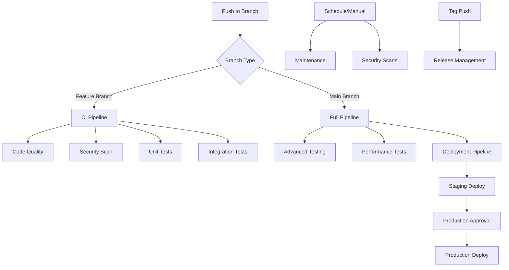

# 🚀 GitHub Actions Workflows Documentation

This document provides comprehensive documentation for all GitHub Actions workflows in this repository.
Our CI/CD pipeline is designed with enterprise-grade standards, security-first approach, and maximum
automation.

## 🎯 Overview

Our workflow system consists of **19 comprehensive workflows** organized into two categories:

### Core Development Workflows (7)

1. **🔄 CI Pipeline** - Core continuous integration
2. **🧪 Advanced Testing** - Comprehensive testing suite
3. **🛡️ Security & Compliance** - Security scanning and compliance checks
4. **🚀 Deployment Pipeline** - Production deployment with safety checks
5. **📦 Release Management** - Automated release creation and distribution
6. **⚡ Performance Monitoring** - Performance testing and monitoring
7. **🔧 Maintenance & Monitoring** - Repository health and automated maintenance

### Automation & Developer Experience (12)

1. **🏷️ PR Labeler** - Auto-label PRs based on file changes
2. **🤖 Dependabot Auto-Merge** - Intelligent dependency update merging
3. **🗑️ Stale Management** - Automated stale issue/PR management
4. **🔍 CodeQL Analysis** - Advanced security scanning
5. **📊 Code Coverage** - Coverage enforcement and reporting
6. **📜 License Check** - Dependency license compliance
7. **📏 PR Size Labeler** - PR size classification and warnings
8. **🔒 Thread Lock** - Lock closed issues and merged PRs
9. **👋 Contributor Greeting** - Welcome first-time contributors
10. **🔗 Link Checker** - Documentation link validation
11. **🧹 Branch Cleanup** - Automatic branch deletion after merge
12. **📝 Update Documentation** - Auto-update documentation dates

## 📊 Workflow Architecture



---

## 1. 🔄 CI Pipeline (`ci.yml`)

### Purpose

Core continuous integration pipeline that runs on every push and pull request to ensure code quality and stability.

### Triggers

- Push to `main` or `develop` branches
- Pull requests to `main` or `develop` branches
- Manual dispatch

### Jobs Overview

```yaml
Jobs: 7 parallel jobs + 1 consolidation job
Duration: ~10-15 minutes
Matrix: Node.js 18, 20, 22
```

#### Job Breakdown

1. **🔍 Code Quality**
   - ESLint analysis with 60+ rules
   - Prettier formatting validation
   - TypeScript type checking
   - Secret detection (Secretlint)

2. **🛡️ Security Scan**
   - npm audit for vulnerabilities
   - Dockerfile security (Hadolint)
   - Container scanning (Trivy)
   - CodeQL static analysis

3. **🧪 Unit Tests**
   - Jest test runner
   - Coverage reporting (Codecov)
   - Coverage threshold enforcement (90% for critical files)
   - Multi-Node.js version matrix

4. **🔗 Integration Tests**
   - Frontend integration tests (mocked APIs)
   - Backend integration tests (real endpoints)
   - Parallel execution for speed

5. **🏗️ Build Verification**
   - Next.js production build
   - Bundle size analysis
   - Build artifact caching

6. **⚡ Performance Validation**
   - Lighthouse CI performance audits
   - Bundle size limit enforcement
   - Core Web Vitals validation

7. **📦 Dependency Check**
   - Unused dependency detection (Knip)
   - Circular dependency detection (Madge)
   - License compliance verification

### Success Criteria

All jobs must pass for the CI pipeline to succeed. Failure in any job blocks merging.

### Notifications

- Slack notifications on main branch
- PR comments with coverage reports
- Security alerts for vulnerabilities

---

## 2. 🧪 Advanced Testing Suite (`test-suite.yml`)

### Purpose

Comprehensive testing across multiple browsers, devices, and scenarios to ensure application quality.

### Triggers

- Push/PR to main branches
- Daily scheduled runs (2 AM UTC)
- Manual dispatch with test type selection

### Jobs Overview

```yaml
Jobs: 7 specialized testing jobs
Duration: ~20-45 minutes
Matrix: 3 browsers × 4 shards (E2E), 3 OS × 2 browsers (Cross-browser)
```

#### Job Breakdown

1. **🎭 E2E Tests**
   - Playwright across Chromium, Firefox, WebKit
   - Sharded execution (4 parallel shards per browser)
   - Critical user journey validation
   - Automatic retry on failure

2. **👁️ Visual Regression**
   - Screenshot comparison testing
   - Component-level visual validation
   - Baseline management
   - Cross-browser visual consistency

3. **♿ Accessibility Tests**
   - axe-core compliance validation
   - WCAG 2.1 AA standard verification
   - Keyboard navigation testing
   - Screen reader compatibility

4. **⚡ Performance Tests**
   - Core Web Vitals measurement
   - Lighthouse performance audits
   - Load testing with realistic traffic
   - Performance budget enforcement

5. **🌐 Cross-Browser Tests**
   - Ubuntu, macOS, Windows testing
   - Multiple browser combinations
   - Platform-specific behavior validation

6. **📱 Mobile Tests**
   - iPhone, Android, iPad simulation
   - Touch interaction testing
   - Responsive design validation

7. **📊 Test Report Consolidation**
   - Unified test reporting
   - Artifact management
   - PR comment integration

### Test Types Selection

Manual dispatch allows selective test execution:

- `all` - Complete test suite
- `e2e` - End-to-end tests only
- `visual` - Visual regression only
- `accessibility` - A11y tests only
- `performance` - Performance tests only
- `cross-browser` - Cross-browser validation

---

## 3. 🛡️ Security & Compliance (`security.yml`)

### Purpose

Multi-layered security scanning and compliance validation to ensure application security.

### Triggers

- Push/PR to main branches
- Daily scheduled scans (1 AM UTC)
- Manual dispatch with scan type selection

### Jobs Overview

```yaml
Jobs: 6 security domains + 1 compliance report
Duration: ~15-25 minutes
Security Tools: 15+ integrated scanners
```

#### Job Breakdown

1. **🔍 SAST Analysis**
   - CodeQL static analysis
   - Semgrep security patterns
   - ESLint security plugin
   - Custom security rules

2. **📦 Dependency Security**
   - npm audit vulnerability scanning
   - Snyk dependency analysis
   - License compliance checking
   - SBOM (Software Bill of Materials) generation

3. **🐳 Container Security**
   - Hadolint Dockerfile analysis
   - Trivy container vulnerability scanning
   - Docker Scout security analysis
   - Multi-stage build security

4. **🔐 Secret Detection**
   - Secretlint pattern matching
   - TruffleHog secret scanning
   - GitLeaks historical analysis
   - Custom secret patterns

5. **☸️ Kubernetes Security**
   - kube-score best practices
   - kubeval manifest validation
   - Conftest policy enforcement (OPA)
   - Kubesec security scoring

6. **📋 Compliance Report**
   - Unified security dashboard
   - Risk assessment scoring
   - Compliance status tracking
   - Remediation recommendations

### Security Standards

- **SAST**: Static Application Security Testing
- **SCA**: Software Composition Analysis
- **Container**: Container and Infrastructure Security
- **Secrets**: Secret and Credential Management
- **Policy**: Security Policy Enforcement

### Compliance Integration

- SARIF format for GitHub Security tab
- Automated security advisory creation
- Integration with security information systems
- Audit trail maintenance

---

## 4. 🚀 Deployment Pipeline (`deploy.yml`)

### Purpose

Production-ready deployment pipeline with blue-green deployment strategy and comprehensive safety checks.

### Triggers

- Push to `main` branch
- Git tags (`v*.*.*`)
- Manual dispatch with environment selection

### Jobs Overview

```yaml
Jobs: 7 deployment stages
Duration: ~25-40 minutes
Strategy: Blue-Green Deployment
Environments: Staging → Production
```

#### Job Breakdown

1. **✅ Pre-deployment Checks**
   - Security pre-flight validation
   - Critical test execution
   - Build verification
   - Version extraction

2. **🐳 Build & Push Image**
   - Multi-arch Docker builds (amd64, arm64)
   - Container signing (Cosign)
   - SBOM generation
   - Security scanning

3. **🎪 Deploy to Staging**
   - Kubernetes deployment
   - Health check validation
   - Smoke test execution
   - Environment verification

4. **🔗 Staging Integration Tests**
   - Full integration test suite
   - Performance validation
   - End-to-end testing
   - User acceptance criteria

5. **🔐 Production Approval**
   - Manual approval gate
   - Stakeholder notification
   - Deployment readiness check
   - Change management integration

6. **🌟 Deploy to Production**
   - Blue-green deployment strategy
   - Traffic switching validation
   - Soak period monitoring
   - Automatic rollback capability

7. **📊 Post-deployment Monitoring**
   - Performance monitoring
   - Health check validation
   - Success metrics collection
   - Alert configuration

### Deployment Strategy

#### Blue-Green Deployment

1. Deploy new version (Green) alongside current (Blue)
2. Validate Green deployment health
3. Switch traffic from Blue to Green
4. Monitor during soak period
5. Clean up Blue deployment on success

#### Safety Mechanisms

- **Health Checks**: Comprehensive application health validation
- **Rollback**: Automatic rollback on failure detection
- **Monitoring**: Real-time performance and error monitoring
- **Approvals**: Manual gates for production deployments

### Environment Configuration

- **Staging**: `staging.recipe-app.example.com`
- **Production**: `recipe-app.example.com`
- **Monitoring**: Integrated with alerting systems

---

## 5. 📦 Release Management (`release.yml`)

### Purpose

Automated release creation with semantic versioning, changelog generation, and multi-platform distribution.

### Triggers

- Push to `main` branch (auto-analysis)
- Manual dispatch with release type selection

### Jobs Overview

```yaml
Jobs: 7 release stages
Duration: ~20-35 minutes
Strategy: Conventional Commits → Semantic Versioning
Artifacts: GitHub Release, Docker Images, Platform Binaries
```

#### Job Breakdown

1. **🔍 Analyze Commits**
   - Conventional commit parsing
   - Semantic version calculation
   - Breaking change detection
   - Changelog generation

2. **📝 Create Release PR**
   - Version bump automation
   - CHANGELOG.md updates
   - Release branch creation
   - PR with release notes

3. **🏗️ Build Release Assets**
   - Multi-platform binary builds
   - Archive creation (tar.gz, zip)
   - Asset verification
   - Platform-specific packaging

4. **🎉 Create GitHub Release**
   - Git tag creation
   - Release notes generation
   - Asset upload
   - Release publication

5. **🐳 Build Release Images**
   - Multi-arch Docker builds
   - Image signing and verification
   - Registry push (ghcr.io)
   - Latest tag management

6. **📚 Update Documentation**
   - Version badge updates
   - API documentation generation
   - Release documentation
   - Change log maintenance

7. **📢 Post-release Notifications**
   - Team notifications
   - Release announcements
   - Integration webhooks
   - Success confirmations

### Release Types

#### Semantic Versioning

- **Major** (`X.0.0`): Breaking changes (`feat!:`, `BREAKING CHANGE`)
- **Minor** (`0.X.0`): New features (`feat:`)
- **Patch** (`0.0.X`): Bug fixes (`fix:`)
- **Prerelease** (`0.0.0-beta.X`): Beta releases

#### Conventional Commits

```text
feat: add new recipe search functionality
fix: resolve authentication token expiry
feat!: change API response structure
docs: update deployment documentation
```

### Distribution Channels

- **GitHub Releases**: Source code and binaries
- **Container Registry**: Docker images (ghcr.io)
- **npm Registry**: Package distribution (if applicable)
- **Documentation Sites**: Auto-generated docs

---

## 6. ⚡ Performance Monitoring (`performance.yml`)

### Purpose

Comprehensive performance testing and monitoring to ensure optimal application performance.

### Triggers

- Push/PR to main branches
- Daily performance tests (3 AM UTC)
- Weekly comprehensive analysis (Sundays 2 AM UTC)
- Manual dispatch with test type selection

### Jobs Overview

```yaml
Jobs: 6 performance domains + 1 regression analysis
Duration: ~20-30 minutes
Tools: Lighthouse, Playwright, Clinic.js, Autocannon
```

#### Job Breakdown

1. **🏮 Lighthouse Audit**
   - Performance score validation
   - Core Web Vitals measurement
   - Best practices compliance
   - SEO optimization checks
   - Matrix: 4 pages × 2 devices

2. **🎯 Core Web Vitals**
   - LCP (Largest Contentful Paint) < 2.5s
   - CLS (Cumulative Layout Shift) < 0.1
   - FID (First Input Delay) < 100ms
   - FCP (First Contentful Paint) < 1.8s
   - TTFB (Time to First Byte) < 600ms

3. **🔥 Load Testing**
   - Concurrent user simulation
   - Response time measurement
   - Throughput analysis
   - Error rate monitoring
   - Scenarios: Normal, Peak, Stress testing

4. **📦 Bundle Analysis**
   - Bundle size monitoring
   - Code splitting validation
   - Dependency analysis
   - Performance budget enforcement
   - Tree shaking effectiveness

5. **🧠 Memory Profiling**
   - Memory usage analysis
   - Leak detection
   - GC performance monitoring
   - Resource optimization
   - Clinic.js integration

6. **📈 Regression Detection**
   - Performance comparison
   - Baseline establishment
   - Trend analysis
   - Alert generation
   - PR performance impact

### Performance Thresholds

#### Load Testing Scenarios

```yaml
Normal Load: 50 users,  300s duration, <500ms P95, >100 RPS
Peak Load: 200 users,  180s duration, <1000ms P95, >50 RPS
Stress Test: 500 users,  120s duration, <2000ms P95, >20 RPS
```

#### Bundle Size Limits

```yaml
Total Bundle: < 250KB gzipped
First Load JS: < 128KB gzipped
Largest Bundle: < 244KB gzipped
```

### Performance Budget

Automated enforcement of performance budgets with build failure on regression.

---

## 7. 🔧 Maintenance & Monitoring (`maintenance.yml`)

### Purpose

Automated repository maintenance, health monitoring, and proactive issue detection.

### Triggers

- Daily maintenance (4 AM UTC)
- Weekly comprehensive maintenance (Sundays 1 AM UTC)
- Monthly deep maintenance (1st day 12 AM UTC)
- Manual dispatch with maintenance type selection

### Jobs Overview

```yaml
Jobs: 6 maintenance domains + 1 comprehensive summary
Duration: ~15-25 minutes
Health Score: 0-100 repository health rating
```

#### Job Breakdown

1. **🏥 Repository Health**
   - Dependency freshness analysis
   - Security vulnerability assessment
   - Code quality metrics
   - Test coverage validation
   - Overall health scoring (0-100)

2. **📦 Dependency Management**
   - Outdated package identification
   - Unused dependency detection
   - Security audit execution
   - License compliance verification
   - Clean installation verification

3. **🔒 Security Maintenance**
   - Secret detection scanning
   - Git history analysis
   - Certificate status checking
   - Security policy validation
   - Vulnerability trend analysis

4. **🧹 Repository Cleanup**
   - Old workflow run cleanup
   - Stale issue management
   - PR lifecycle management
   - Branch cleanup recommendations
   - Storage optimization

5. **💾 Backup Validation**
   - Repository integrity checking
   - Backup completeness verification
   - Critical file validation
   - Cloud backup status
   - Recovery procedure testing

6. **📊 Monitoring & Alerts**
   - Health threshold monitoring
   - Trend analysis and alerting
   - Performance baseline tracking
   - Incident response preparation
   - Dashboard generation

### Health Scoring System

#### Score Calculation

```yaml
Base Score: 100 points
Deductions:
  - Critical vulnerabilities: -30 points each
  - High vulnerabilities: -15 points each
  - >10 outdated dependencies: -10 points
  - >5 unused dependencies: -5 points
  - Coverage below threshold: -10 points
  - >5 large files (500+ lines): -5 points
```

#### Health Status

- **90-100**: ✅ Excellent - Repository in great shape
- **80-89**: 🟡 Good - Minor issues to address
- **70-79**: 🟠 Fair - Needs attention
- **<70**: 🔴 Poor - Immediate action required

### Automated Actions

- **Dependency Updates**: Via Dependabot integration
- **Security Patches**: Auto-merge critical security updates
- **Cleanup Tasks**: Old data and artifact removal
- **Health Reporting**: Regular health status updates

---

## 8. 🏷️ PR Labeler (`pr-labeler.yml`)

### Purpose

Automatically label pull requests based on the files changed, improving PR organization and making it easier to
filter and search for specific types of changes.

### Triggers

- Pull request opened, synchronized, or reopened

### Configuration

Uses `.github/labeler.yml` for label mapping rules based on file patterns.

### Labels Applied

- `dependencies` - package.json, package-lock.json changes
- `documentation` - Markdown and documentation changes
- `github-actions` - Workflow file changes
- `docker` - Docker configuration changes
- `javascript` - JS/TS source code changes
- `testing` - Test file changes
- `frontend` - Component changes
- `api` - API integration changes
- And many more based on changed files

### Benefits

- Automatic categorization of PRs
- Improved searchability and filtering
- Consistent labeling across the repository
- Reduced manual labeling effort

---

## 9. 🤖 Dependabot Auto-Merge (`dependabot-auto-merge.yml`)

### Purpose

Intelligently auto-approve and auto-merge safe Dependabot dependency updates, reducing maintenance burden while
maintaining security.

### Triggers

- Dependabot pull requests (opened, synchronized, reopened)

### Auto-Merge Strategy

#### Patch Updates

- **Action**: Auto-approve and auto-merge
- **Rationale**: Patch updates are backward-compatible bug fixes
- **Safety**: All CI checks must pass

#### Minor Updates (Indirect Dependencies)

- **Action**: Auto-approve and auto-merge
- **Rationale**: Indirect dependencies with minor version bumps are low-risk
- **Safety**: All CI checks must pass

#### Minor Updates (Direct Dependencies)

- **Action**: Auto-approve only (manual merge required)
- **Rationale**: Direct dependencies need review for API changes
- **Safety**: Allows time for testing

#### Major Updates

- **Action**: Comment only (full manual review required)
- **Comment**: Warns that major version update requires manual review
- **Rationale**: Breaking changes need careful evaluation

### Safety Mechanisms

- All CI checks must pass before auto-merge
- Uses Dependabot metadata for intelligent decisions
- Squash merge to keep clean history
- Automatic approval from GitHub Actions

---

## 10. 🗑️ Stale Management (`stale.yml`)

### Purpose

Automatically identify and close stale issues and pull requests to keep the repository clean and focused on active work.

### Triggers

- Daily schedule (midnight UTC)
- Manual dispatch

### Configuration

#### Issues

- **Stale after**: 60 days of inactivity
- **Close after**: 14 days of being marked stale
- **Exempt labels**: `pinned`, `security`, `critical`, `in-progress`

#### Pull Requests

- **Stale after**: 60 days of inactivity
- **Close after**: 14 days of being marked stale
- **Exempt labels**: `pinned`, `security`, `work-in-progress`, `blocked`

### Behavior

1. **Mark as Stale**: Adds `stale` label and posts helpful comment
2. **Wait Period**: 14-day grace period for activity
3. **Close**: Automatically closes if no activity during grace period
4. **Reopen**: Removing `stale` label or adding comment prevents closure

### Messages

Friendly, helpful messages that:

- Explain why the issue/PR was marked stale
- Provide clear steps to keep it open
- Encourage creating new issues with updated information

---

## 11. 🔍 CodeQL Analysis (`codeql.yml`)

### Purpose

Advanced security analysis using GitHub's CodeQL to detect security vulnerabilities, bugs, and code quality issues
in JavaScript/TypeScript code.

### Triggers

- Push to `main` or `develop` branches
- Pull requests to `main` or `develop` branches
- Weekly schedule (Wednesday 6 AM UTC)
- Manual dispatch

### Analysis Scope

- **Languages**: JavaScript/TypeScript
- **Queries**: Security and quality queries
- **Upload**: Results uploaded to GitHub Security tab

### What It Detects

- SQL injection vulnerabilities
- Cross-site scripting (XSS)
- Path traversal issues
- Unsafe deserialization
- Hardcoded credentials
- And 100+ other security patterns

### Integration

- Results appear in GitHub Security tab
- Annotations on pull requests
- SARIF format for standardized reporting
- Automatic security advisory creation

---

## 12. 📊 Code Coverage (`coverage.yml`)

### Purpose

Enforce code coverage thresholds and provide visibility into test coverage changes in pull requests.

### Triggers

- Pull requests to `main` or `develop` branches
- Push to `main` branch

### Coverage Requirements

- **Threshold**: 80% minimum coverage
- **Enforcement**: Build fails if coverage drops below threshold
- **Reporting**: Codecov integration for detailed reports

### Features

#### PR Comments

- Coverage diff showing changes
- Line-by-line coverage information
- Visual indicators for coverage increase/decrease
- Links to detailed Codecov reports

#### Coverage Reports

- Uploaded to Codecov for trending analysis
- Historical coverage tracking
- Per-file and per-function coverage
- Coverage artifacts retained for 30 days

### Benefits

- Prevents coverage regressions
- Visibility into test quality
- Encourages comprehensive testing
- Historical coverage trending

---

## 13. 📜 License Check (`license-check.yml`)

### Purpose

Validate that all npm dependencies use acceptable licenses and block problematic licenses that could create legal issues.

### Triggers

- Pull requests modifying `package.json` or `package-lock.json`
- Weekly schedule (Monday 6 AM UTC)
- Manual dispatch

### Blocked Licenses

- **GPL-3.0**: Strong copyleft requiring source distribution
- **AGPL-3.0**: Network copyleft for SaaS applications
- **LGPL-3.0**: Copyleft for libraries

### Features

#### License Report

- Complete list of all dependency licenses
- License summary statistics
- JSON export for analysis
- 90-day artifact retention

#### PR Integration

- Automatic PR comments on license violations
- Detailed violation information
- Suggestions for remediation
- Build failure on forbidden licenses

### License Compliance

- Allows: MIT, Apache-2.0, BSD, ISC, CC0-1.0
- Review required: Other permissive licenses
- Blocked: Copyleft licenses

---

## 14. 📏 PR Size Labeler (`pr-size.yml`)

### Purpose

Automatically label pull requests by size and encourage smaller, more reviewable PRs.

### Triggers

- Pull request opened, reopened, or synchronized

### Size Categories

- **XS**: < 10 lines changed (🟢 Bright Green)
- **S**: 10-99 lines changed (🟢 Green)
- **M**: 100-499 lines changed (🟡 Yellow)
- **L**: 500-999 lines changed (🟠 Orange)
- **XL**: 1000+ lines changed (🔴 Red)

### Features

#### Automatic Labeling

- Removes old size labels
- Adds current size label
- Creates labels if they don't exist
- Color-coded for easy identification

#### Large PR Warning

- Comments on XL PRs (1000+ lines)
- Suggests breaking into smaller PRs
- Explains benefits of smaller PRs
- Only comments once per PR

### Benefits

- Encourages smaller, focused PRs
- Easier code reviews
- Faster feedback cycles
- Reduced risk of bugs
- Visual size indicators

---

## 15. 🔒 Thread Lock (`lock.yml`)

### Purpose

Automatically lock closed issues and merged pull requests after a period of inactivity to prevent necroposting and
keep discussions focused.

### Triggers

- Daily schedule (midnight UTC)
- Manual dispatch

### Locking Policy

#### Closed Issues

- **Lock after**: 90 days of inactivity
- **Reason**: `resolved`
- **Exempt labels**: `pinned`, `security`
- **Comment**: Helpful message directing to new issues

#### Merged PRs

- **Lock after**: 60 days of inactivity
- **Reason**: `resolved`
- **Exempt labels**: `pinned`
- **Comment**: Helpful message for related concerns

### Benefits

- Prevents necroposting on old issues
- Encourages new issues with fresh context
- Keeps discussions relevant
- Reduces notification noise
- Maintains clean issue tracker

---

## 16. 👋 Contributor Greeting (`greet.yml`)

### Purpose

Welcome first-time contributors with helpful information and resources, creating a positive first impression.

### Triggers

- First-time issue creation
- First-time pull request

### Greetings

#### First Issue

- Warm welcome message
- Explanation of what happens next
- Response time expectations
- Links to helpful resources:
  - Contributing Guide
  - Code of Conduct
  - Support Documentation

#### First Pull Request

- Congratulatory message
- Review process explanation
- Pre-merge checklist
- Links to development resources:
  - Contributing Guide
  - Development Guide (CLAUDE.md)
  - PR Template

### Benefits

- Welcoming community atmosphere
- Reduced confusion for new contributors
- Sets clear expectations
- Provides helpful resources upfront
- Increases contributor retention

---

## 17. 🔗 Link Checker (`links.yml`)

### Purpose

Automatically detect broken links in documentation to ensure all external and internal links remain valid.

### Triggers

- Pull requests modifying markdown files
- Weekly schedule (Sunday midnight UTC)
- Manual dispatch

### Scope

- All markdown files (`.md`, `.mdx`)
- README, CLAUDE.md, and other documentation
- Maximum depth of 3 levels
- Configurable patterns via `.github/markdown-link-check.json`

### Features

#### Link Validation

- External URL checking
- Internal link verification
- Relative link validation
- Timeout and retry logic (20s timeout, 3 retries)

#### Reporting

**On Schedule**: Creates issue for broken links
**On PR**: Comments on PR with broken link details

### Configuration

Ignores localhost URLs and configurable patterns:

- `http://localhost:*`
- `http://127.0.0.1:*`
- `https://localhost:*`

### Benefits

- Prevents broken documentation
- Maintains professional appearance
- Catches link rot early
- Automated maintenance

---

## 18. 🧹 Branch Cleanup (`cleanup.yml`)

### Purpose

Automatically delete feature branches after pull requests are merged to keep the repository clean and organized.

### Triggers

- Pull request closed (merged only)

### Behavior

#### Automatic Deletion

- Only deletes branches from same repository (not forks)
- Protects main branches: `main`, `master`, `develop`, `staging`, `production`
- Deletes branch immediately after merge
- Comments on PR confirming deletion

#### Protected Branches

Never deletes:

- `main`, `master`
- `develop`
- `staging`, `production`
- Any branch from forked repository

### Benefits

- Keeps repository clean
- Reduces clutter
- No manual cleanup needed
- Clear branch lifecycle
- Prevents confusion about active branches

---

## 🔄 Dependency Management (Dependabot)

### Purpose

Automated dependency updates with GitHub's native Dependabot, providing security vulnerability alerts and version
updates with intelligent grouping strategies.

### Configuration (`.github/dependabot.yml`)

GitHub-native dependency management with security-first approach and intelligent update grouping.

### Key Features

#### 🚨 Security-First Approach

- **Security Alerts**: Automatic security vulnerability detection
- **Priority Updates**: Security patches prioritized over feature updates
- **Immediate Action**: Security updates trigger immediately when detected
- **Integration**: Native GitHub Security tab integration

#### 📦 Intelligent Grouping

**Production Dependencies**:

- Minor and patch updates grouped together
- Reduces PR noise while maintaining safety
- Careful review for production stability

**Development Dependencies**:

- Minor and patch updates grouped together
- Faster iteration on dev tooling
- Independent from production changes

**GitHub Actions**:

- All action updates grouped together
- Maintains workflow consistency
- Simplified review process

**Docker**:

- Base image updates tracked separately
- Security scanning integrated
- Multi-arch build compatibility

#### ⏰ Smart Scheduling

```yaml
Schedule: Monday 9:00 AM Eastern Time
Timezone: US/Eastern
Open PR Limit: 100
Concurrent PRs: Managed automatically
```

#### 🔍 Update Strategy

- **Versioning**: Increase strategy for compatibility
- **Rebase**: Automatic rebase on conflicts
- **Commit Messages**: Conventional commits with scope
  - Production: `deps: update package to vX.Y.Z`
  - Development: `deps-dev: update package to vX.Y.Z`
  - CI: `ci: update action to vX.Y.Z`
  - Docker: `docker: update image to vX.Y.Z`

### Package Ecosystems

1. **📦 NPM Dependencies**
   - Production and development packages
   - Grouped by dependency type
   - Weekly updates on Mondays
   - Conventional commit messages

2. **⚙️ GitHub Actions**
   - Workflow dependency updates
   - All actions grouped together
   - Weekly updates on Mondays
   - Version pinning maintained

3. **🐳 Docker Images**
   - Base image updates
   - Security scanning integration
   - Weekly updates on Mondays
   - Multi-arch compatibility

### Quality Gates

- **Status Checks**: All CI checks must pass before merge
- **Auto-Merge**: Handled by `dependabot-auto-merge.yml` workflow
- **Test Coverage**: Maintain coverage thresholds
- **Performance**: Bundle size limits enforced
- **Security**: No new vulnerabilities introduced

---

## 📋 Workflow Summary Table

Quick reference for all 19 workflows in this repository:

### Core Development Workflows

| #   | Workflow                    | File              | Trigger          | Duration   | Auto/Manual |
| --- | --------------------------- | ----------------- | ---------------- | ---------- | ----------- |
| 1   | 🔄 CI Pipeline              | `ci.yml`          | Push/PR          | ~10-15 min | Auto        |
| 2   | 🧪 Advanced Testing         | `test-suite.yml`  | Push/PR/Schedule | ~20-45 min | Both        |
| 3   | 🛡️ Security & Compliance    | `security.yml`    | Push/PR/Schedule | ~15-25 min | Both        |
| 4   | 🚀 Deployment Pipeline      | `deploy.yml`      | Push/Tag         | ~25-40 min | Both        |
| 5   | 📦 Release Management       | `release.yml`     | Push/Manual      | ~20-35 min | Both        |
| 6   | ⚡ Performance Monitoring   | `performance.yml` | Push/PR/Schedule | ~20-30 min | Both        |
| 7   | 🔧 Maintenance & Monitoring | `maintenance.yml` | Schedule         | ~15-25 min | Both        |

### Automation & Developer Experience

| #   | Workflow                 | File                        | Trigger          | Duration  | Auto/Manual |
| --- | ------------------------ | --------------------------- | ---------------- | --------- | ----------- |
| 8   | 🏷️ PR Labeler            | `pr-labeler.yml`            | PR               | < 1 min   | Auto        |
| 9   | 🤖 Dependabot Auto-Merge | `dependabot-auto-merge.yml` | Dependabot PR    | < 1 min   | Auto        |
| 10  | 🗑️ Stale Management      | `stale.yml`                 | Schedule (daily) | ~2-5 min  | Both        |
| 11  | 🔍 CodeQL Analysis       | `codeql.yml`                | Push/PR/Schedule | ~5-10 min | Auto        |
| 12  | 📊 Code Coverage         | `coverage.yml`              | Push/PR          | ~3-5 min  | Auto        |
| 13  | 📜 License Check         | `license-check.yml`         | PR/Schedule      | ~2-3 min  | Both        |
| 14  | 📏 PR Size Labeler       | `pr-size.yml`               | PR               | < 1 min   | Auto        |
| 15  | 🔒 Thread Lock           | `lock.yml`                  | Schedule (daily) | ~1-2 min  | Both        |
| 16  | 👋 Contributor Greeting  | `greet.yml`                 | First Issue/PR   | < 1 min   | Auto        |
| 17  | 🔗 Link Checker          | `links.yml`                 | PR/Schedule      | ~2-3 min  | Both        |
| 18  | 🧹 Branch Cleanup        | `cleanup.yml`               | PR Merged        | < 1 min   | Auto        |
| 19  | 📝 Update Documentation  | `update-docs.yml`           | Push to main     | < 1 min   | Auto        |

### Workflow Categories

**Development & Quality (7 workflows)**

- Comprehensive CI/CD pipeline
- Security scanning and compliance
- Performance monitoring
- Release automation

**Automation & Experience (12 workflows)**

- Automatic PR management
- Contributor engagement
- Repository maintenance
- Quality enforcement

---

## 🚀 Getting Started

### 1. Repository Setup

Ensure the following secrets are configured in your repository:

```yaml
Required Secrets:
  GITHUB_TOKEN: GitHub personal access token
  RELEASE_TOKEN: Token with release permissions
  SLACK_WEBHOOK_URL: Slack notification webhook
  CODECOV_TOKEN: Code coverage reporting
  LIGHTHOUSE_CI_TOKEN: Lighthouse CI integration

Optional Secrets:
  SNYK_TOKEN: Snyk security scanning
  SEMGREP_APP_TOKEN: Semgrep security analysis
  DOCKER_SCOUT_TOKEN: Docker security scanning
  STAGING_KUBECONFIG: Staging Kubernetes config
  PRODUCTION_KUBECONFIG: Production Kubernetes config
```

### 2. Branch Protection

Configure branch protection rules for `main`:

```yaml
Required:
  - Require status checks to pass
  - Require branches to be up to date
  - Require review from code owners
  - Dismiss stale reviews
  - Require signed commits

Status Checks:
  - ci/github-actions-ci
  - security/github-actions-security
  - test-suite/advanced-testing
```

### 3. Environment Configuration

Set up GitHub environments:

```yaml
Environments:
  - staging (auto-deploy)
  - production-approval (manual approval)
  - production (protected)
```

### 4. Dependabot Setup

Dependabot is enabled via the `.github/dependabot.yml` configuration file.

---

## 📊 Monitoring & Observability

### Workflow Monitoring

Track workflow performance and success rates:

- **Success Rate**: Target >95% for all workflows
- **Duration Monitoring**: Alert on significant increases
- **Failure Analysis**: Root cause analysis for failures
- **Resource Usage**: Monitor runner usage and costs

### Performance Baselines

Maintain performance baselines and alert on regressions:

- **Core Web Vitals**: Monthly baseline updates
- **Bundle Size**: Progressive size limit adjustments
- **Test Duration**: Optimize for faster feedback
- **Deployment Time**: Target <20 minutes for full deployment

### Security Monitoring

Continuous security posture monitoring:

- **Vulnerability Trends**: Track vulnerability introduction/resolution
- **Dependency Health**: Monitor dependency age and security
- **Secret Detection**: Prevent credential leakage
- **Compliance Drift**: Maintain security compliance standards

---

## 🛠️ Troubleshooting

### Common Issues

#### 1. CI Pipeline Failures

```bash
# Check logs in GitHub Actions
# Common causes:
- Test failures
- Linting errors
- Security vulnerabilities
- Build issues
```

#### 2. Deployment Issues

```bash
# Kubernetes deployment problems:
kubectl get pods -n staging
kubectl logs -f deployment/recipe-ui-service -n staging

# Health check failures:
curl -f https://staging.recipe-app.example.com/api/health
```

#### 3. Performance Regressions

```bash
# Bundle size analysis:
npm run analyze

# Performance profiling:
npm run perf:vitals
npm run perf:lighthouse
```

#### 4. Security Scan Failures

```bash
# Local security scanning:
npm audit --audit-level=high
npx secretlint "**/*"
```

### Debug Mode

Enable debug mode for workflows by setting repository variable:

```yaml
ACTIONS_STEP_DEBUG: true
ACTIONS_RUNNER_DEBUG: true
```

---

## 🎯 Best Practices

### 1. Commit Messages

Use conventional commits for automatic release management:

```bash
feat: add user authentication system
fix: resolve memory leak in data processing
feat!: change API response format (breaking change)
docs: update deployment documentation
test: add integration tests for payment flow
```

### 2. Pull Request Guidelines

- **Small, focused changes**: Easier to review and test
- **Descriptive titles**: Clear description of changes
- **Test coverage**: Ensure adequate test coverage
- **Documentation**: Update docs for user-facing changes
- **Performance impact**: Consider bundle size and performance

### 3. Security Guidelines

- **No secrets in code**: Use environment variables and secrets management
- **Regular updates**: Keep dependencies updated
- **Least privilege**: Minimal required permissions
- **Audit trail**: Maintain comprehensive logs

### 4. Performance Guidelines

- **Bundle size awareness**: Monitor and optimize bundle size
- **Code splitting**: Implement proper code splitting
- **Image optimization**: Optimize images and assets
- **Caching strategy**: Implement effective caching

---

## 📚 Additional Resources

### Documentation

- [GitHub Actions Documentation](https://docs.github.com/en/actions)
- [Dependabot Configuration Reference](https://docs.github.com/en/code-security/dependabot)
- [Semantic Versioning Specification](https://semver.org/)
- [Conventional Commits](https://www.conventionalcommits.org/)

### Tools & Integrations

- [Lighthouse CI](https://github.com/GoogleChrome/lighthouse-ci)
- [Playwright](https://playwright.dev/)
- [CodeQL](https://codeql.github.com/)
- [Trivy](https://trivy.dev/)

### Community

- [GitHub Community](https://github.community/)
- [GitHub Actions Marketplace](https://github.com/marketplace?type=actions)
- [DevSecOps Community](https://www.devsecops.org/)

---

## 🤝 Contributing

When contributing to workflow improvements:

1. **Test locally**: Use `act` or similar tools for local testing
2. **Incremental changes**: Make small, testable improvements
3. **Documentation**: Update this documentation for changes
4. **Validation**: Ensure all existing functionality continues to work
5. **Security review**: Consider security implications of changes

### Workflow Development

```bash
# Install act for local testing
curl https://raw.githubusercontent.com/nektos/act/master/install.sh | sudo bash

# Test workflow locally
act -W .github/workflows/ci.yml
```

---

## 📈 Statistics

- **Total Workflows**: 18
- **Core Development**: 7 workflows
- **Automation & DX**: 11 workflows
- **Automated Workflows**: 13
- **Manual Dispatch**: 11
- **Scheduled Workflows**: 8

---

**Last Updated**: 2025-10-08

**Maintainer**: [Jonathan Samuelsen](https://github.com/jsamuelsen11)

**Repository**: [recipe-ui-service](https://github.com/Recipe-Web-App/recipe-ui-service)

**Support**: [GitHub Issues](https://github.com/Recipe-Web-App/recipe-ui-service/issues) | [Discussions](https://github.com/Recipe-Web-App/recipe-ui-service/discussions)
